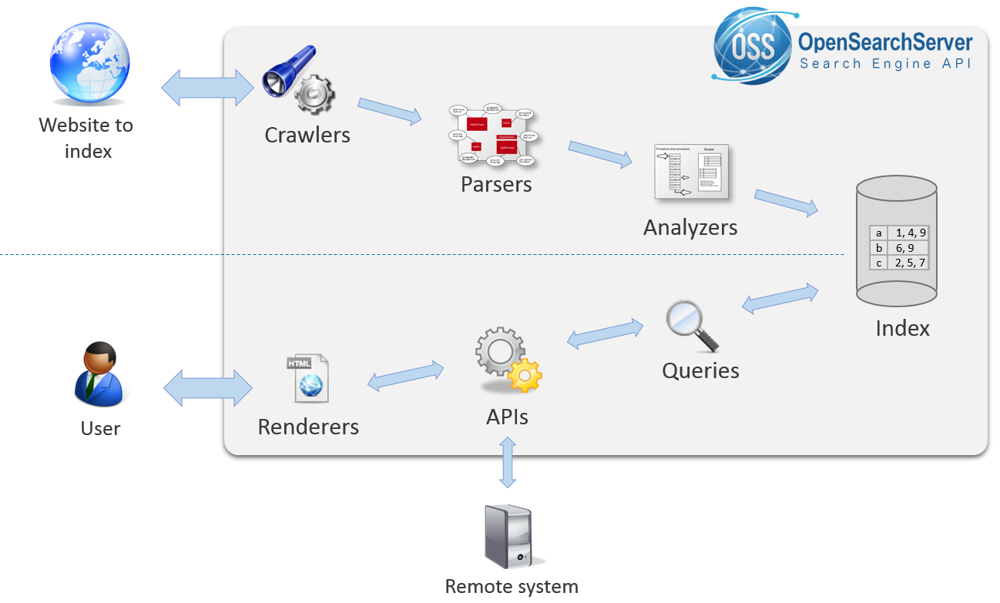
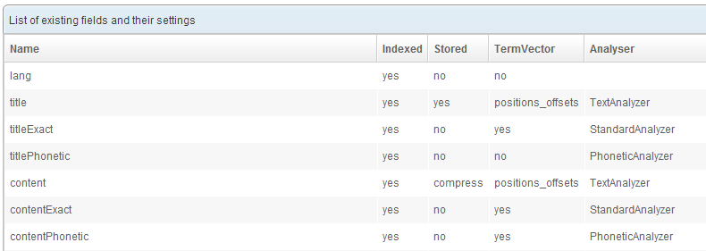
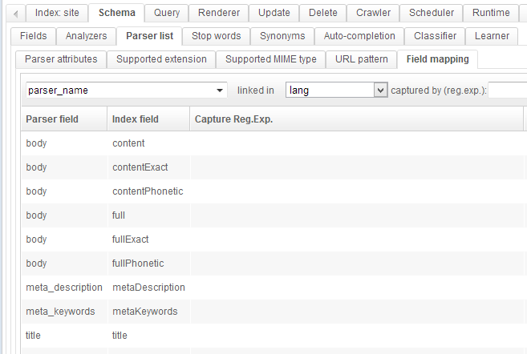

Thanks to tutorial you will quickly learn how to use several awesome features of [OpenSearchServer](http://www.open-search-server.com/fr).

This tutorial has been made for OpenSearchServer 1.5.0 to teach you how to:

* **crawl a website**
* **set up a search index**
* build a **search page** with **autocompletion** and **text extracts**
* **configure facets**

Here is the final result:

Some pages have been prepared to help us in this tutorial. The example is a news website with 4 URL:

* [http://www.open-search-server.com/test-website/](http://www.open-search-server.com/test-website/)
  * [http://www.open-search-server.com/test-website/unemployment-is-decreasing/](http://www.open-search-server.com/test-website/unemployment-is-decreasing/)
  * [http://www.open-search-server.com/test-website/worldcup-2040/](http://www.open-search-server.com/test-website/worldcup-2040/)
  * [http://www.open-search-server.com/test-website/oscar-academy-awards/](http://www.open-search-server.com/test-website/oscar-academy-awards/)

Before starting you will need to [install OpenSearchServer](http://www.open-search-server.com/install-opensearchserver/), which will take you 3 minutes only! 

## A few definitions

Let's see a few key concepts of the search engines area:

* **Index**: this is where documents are stored, sorted and analysed with several algorithms to allow quick search.
* **Crawler**: web crawler explores websites to index their pages. It can follow every links it finds and be limited to some patterns of URL only. It can read lots of types of document: web page, files, images, etc. There are also crawlers for filesystem and databases.
* **Schema**: it is the structure of the index. It defines the fields of indexed documents.
* **Query**: queries are the full-text search queries. Several parameters can be configured in queries, especially which fields to search in, weight for each field, facets, snippets, etc. 
* **Facet**: facets are counters with filters, on particular fields. 
* **Snippet**: snippets are extracts of text containing the searched keywords. 
* **Renderer**: OpenSearchServer renderers are extremely easy to set up and to customize search pages. They can then be embedded in your website to let your users search your index. 
* **Parser**: parser extract structured information from indexed documents (title, author, description, ...) 
* **Analyzer**: analyzers are customizables components which can execute lots of processes on the indexed or searched texts (split texts in tokens, remove accents or plural, ...)  
* **Scheduler** : OpenSearchServer's scheduler is a powerful and highly customizable tasks manager 

This picture shows these main concepts:

Now everything is crystal clear, let's start!

## Set up crawl and index documents

### Index creation and first configuration

Let's start by creating an `index`. As explained the index is the heart of OpenSearchServer. It will store every submitted `document`.

* Name : `site`
* Template : `web crawler`

Click on `Create`.

Chosen template, `Web crawler`, will quickly give us a powerfully configured index. This template embeds a `query`, a `renderer`, a `schema` and an `HTML parser` that are really effective. 

Index is immediately created. You can see that several tabs are added to the main window.

Select tab `Schema`. The schema defines the fields of an index.

A field has 5 properties:

* **Name**: name of the field
* **Indexed**: whether to index the value or not. If the value is indexed, queries will be able to search into this field. 
* **Stored** : whether to store the value or not. If the value is stored, queries will be able to return it as it was when submitted to the index, without the transformations made by the indexation.
* **TermVector** : this property allows, or not, the use of `snippets` on this field.
* **Analyzer** : defines which `analyzer` to use on this field. 

Index has been created with lots of fields.
As you can see some fields are indexed, other stored, etc. This configuration has been made by the OpenSearchServer's team to offer the most effective search.

### HTML parser configuration

How can the crawler know in which field of the schema store each information coming from a web page? This is the role of the `HTML parser`.

Click on tab `Parser list` under the tab `Schema`. This pages lists every available parsers. Click on the `Edit` button of the line `HTML parser`.
Then click on tab `Field mapping`.

Here again you can see that lots of mapping are already configured. On the left of each line is an information the parser extracts from the page, and then is the field of the schema in which this information must go. 

### Crawl configuration

The web crawler needs to be configured in order to crawl our example pages.

Select tab `Crawler`. Make sure tab `Web` is selected then.

In the tab `Pattern list` we will configure which URL we want the crawler to explore.

We want to crawl this website: [http://www.open-search-server.com/test-website/](http://www.open-search-server.com/test-website/). 
We can see this page has links towards every news page. Thus we can tell the crawler to start by this page only, it will discover the links to the other pages. 

In the textarea, write `http://www.open-search-server.com/test-website/*` and then click on the button `Add`.

The `/*` part tells the crawler to explore every page whose URL starts with `http://www.open-search-server.com/test-website/`.

Since every news page is "under" the main page in term of URL it will work fine. 

### Crawl start

To start the crawler select tab `Crawl process`. Here several parameters can be adjusted. For example write `7` in field `Delay between each successive access, in seconds:`, `5` in field `Fetch interval between re-fetches:` and select `minutes` in the list. 

In the block `Current status` choose `Run forever` in the list and then click on the button `Not running - click to run`.

Process automaticaly updates in the area below.

> Tab `Manual crawl` will allow you to quickly and easily test the crawler for one particular URL.

## Search content and customize relevancy

### Full-text search query

Click on tab `Query`. Click on button `Edit` for the ligne `search`.

Queries are used to search contents into the index. Search is made in configured fields, according to the weight each field is given.

As you can see query is made in numerous fields, with some differences of weight. You can easily change weight for each field to change the relevancy of each document.

Tab `Snipppets` lists the configured extracts of text for this query.

You can also easily add some `facets` to this query. To do so go to tab `Facets` and for instance add a facet on field `host`.
In field `minimal count` write `1`  in order to show only values for which more than 1 document can be found.

To save those modifiation click on the `Save` button on the top right of the page.

### Build a search page

So far you created an index, crawled some pages and configured a query.

Let's now see how our documents could be exposed to our visitors.

Click on tab `Renderer`. One `Renderer` is already created by the template of index we chose sooner. Click on `Edit`.

You can see that this renderer uses the query `search`.

Tab `Fields` lets you choose which fields you want to display for each result on the results page. Tab `CSS Style` give you the ability to customize the way this page will be displayed.

Click on `Save & close` and then click on the `View` button to open the renderer in a new window.

Try to search something, for instance `Worldcup 2040`. Voilà! some documents are found and displayed, with a link to the web page and some snippets. 

You can also see that autocompletion is working and that the `host` facet is there on the left!

> You can use the `Testing` tab to quicly get the code that will allow you to easily embed the search form on your website 

## What's next?

We just discovered some of the numerous features of OpenSearchServer.

You could now read our [documentation center](http://www.open-search-server.com/confluence/display/EN/Home), to understand lots of other available parameters and features.

Don't forget to have a look at [our APIs](https://github.com/jaeksoft/opensearchserver/wiki)! They will allow you to easily build a powerful customized application!
