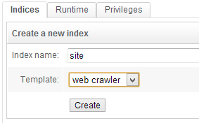
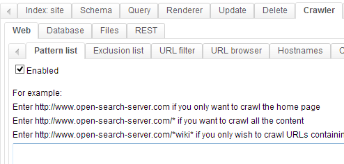
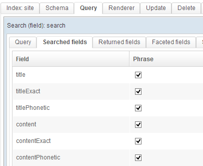
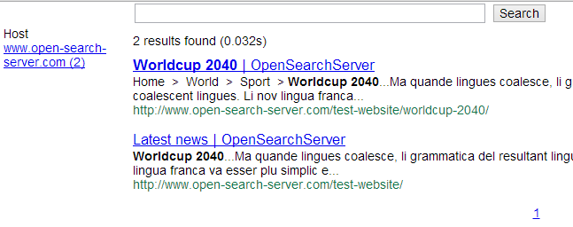

This quick OpenSearchServer 1.5.0 tutorial will teach you how to:

* **crawl a website**
* **set up a search index**
* build a **search page** with **autocompletion** and **text extracts**
* **configure facets**

Here is the final result:

This tutorial uses an example website, which has four URLs:

* [http://www.open-search-server.com/test-website/](http://www.open-search-server.com/test-website/)
  * [http://www.open-search-server.com/test-website/unemployment-is-decreasing/](http://www.open-search-server.com/test-website/unemployment-is-decreasing/)
  * [http://www.open-search-server.com/test-website/worldcup-2040/](http://www.open-search-server.com/test-website/worldcup-2040/)
  * [http://www.open-search-server.com/test-website/oscar-academy-awards/](http://www.open-search-server.com/test-website/oscar-academy-awards/)

This tutorial assumes that you have already [installed OpenSearchServer](http://www.open-search-server.com/install-opensearchserver/), which takes about three minutes.

## A few definitions

Let's review some key concepts about search engines:

* **Index**: this is where documents are stored, sorted and analysed using algorithms that allow for faster searches.
* **Crawler**: a "web crawler" explores websites to index their pages. It can follow every links it finds, or it can be limited to exploring certain URL patterns. A modern web crawler can read many types of document: web pages, files, images, etc. There also exist crawlers that index filesystem and databases rather than web sites.
* **Schema**: this is the structure of the index. It defines the fields of the indexed documents.
* **Query**: the full-text search queries. Several parameters can be configured within queries -- which fields they should search in, how much weight to give to each field, which facets, which snippets, etc. 
* **Facet**: a facet is a dimension shared by multiple documents, which can be used to sort or filter these documents. For instance, with a collection of books, the color of the cover is a possible facet - and you could opt to filter out the blue ones.
* **Snippet**: snippets are excerpts of text containing the searched keywords. 
* **Renderer**: OpenSearchServer renderers are used to set up and customize search pages on your web site.
* **Parser**: parsers extract structured information from indexed documents (title, author, description, ...) 
* **Analyzer**: analyzers are customizable components that can execute multiple processes on the indexed or searched texts. Analyzers might split texts into tokens, remove accents and diacritics, remove plurals, etc.
* **Scheduler** : OpenSearchServer's scheduler is a highly customizable tool to set up reccurent processes.

This picture shows these main concepts:

So far, so good? Let's start working with our example site.

## Set up crawl and index documents

### Index creation and first configuration

Let's start by creating an `index`. An index is the heart of OpenSearchServer. It will store every submitted `document`.

* Name : `site`
* Template : `web crawler`

Click on `Create`.

Chose the template called `Web crawler` to automatically get a properly configured index. The `Web crawler` template embeds a `query`, a `renderer`, a `schema` and an `HTML parser` that are optimised for most uses.

The index has now been created. You can see that several tabs have been added to the main window.

Select the `Schema` tab. The schema defines the fields within an index.

A field has 5 properties:

* **Name**: the name of the field
* **Indexed**: whether to index the value. If a value is indexed, queries can search into this field. 
* **Stored** : whether to store the value. If the value is stored, queries can return it as it was when submitted to the index, without the alterations made to index it.
* **TermVector** : this property allows - or disallows - the use of `snippets` on this field.
* **Analyzer** : defines which `analyzer` to use on this field. 

The index has been automatically created with numerous fields. As you can see some are indexed, other stored, etc. This prepackaged configuration is what usually works best in our experience.

### HTML parser configuration

The `HTML parser` tells the crawler in which fields of the schema to store each bit of information found on a web page.

Click on the tab `Parser list` under the tab `Schema`. This pages lists every available parser. Click on the `Edit` button of the line `HTML parser`.
Then click on tab `Field mapping`.

Here again you can see that many mappings have already been configured. On the left of each line is an information the parser extracts from the page, and next is the field of the schema in which this information must go. 

### Crawl configuration

The web crawler needs to be configured in order to crawl our example pages.

Select tab `Crawler`. Make sure that the tab `Web` is selected.

In the tab `Pattern list` we will configure which URLs the crawler should explore.

We want to crawl this website: [http://www.open-search-server.com/test-website/](http://www.open-search-server.com/test-website/). 
This page has links towards every news page. Thus, we can simply tell the crawler to start with this page, since it will discover the links to the other pages. 

In the text area, write `http://www.open-search-server.com/test-website/*` and then click on the button `Add`.

The `/*` part is a wild card telling the crawler to explore every page whose URL starts with `http://www.open-search-server.com/test-website/`.

Since every news page linked on the main page has an URL that starts this way, this fits our need.

### Crawl start

To start the crawler, select the `Crawl process` tab. There, several parameters can be adjusted. For example write `7` in the field `Delay between each successive access, in seconds:`, `5` in the field `Fetch interval between re-fetches:` and select `minutes` in the following list. 

In the block `Current status` choose `Run forever` -- and then click on the button `Not running - click to run`.

The process automaticaly reports its status in the area below.

> The tab `Manual crawl` allows you to easily test a crawler on a specific URL.

## Search content and customize relevancy

### Full-text search query

Click on the `Query` tab. Click on the `Edit` button corresponding to the `search` line.

Queries are used to search for content within the index. A search is run within the selected fields, according to the weight assigned to each field.

As you can see the prepackaged query is run across numerous fields, with some differences in weight. You can easily change the weight for each field to better match how the information is organised.

The `Snipppets` tab lists the configured excerpts of text for this query.

You can also easily add some `facets-based filtering` to this query. To do so go to the `Facets` tab. As an example add a facet to the `host` field. In the `minimal count` field write `1`. Now the query will only return values for which more than one document can be found.

To save those modifiation click on the `Save` button in the top right corner of the page.

### Build a search page

So far you created an index, crawled some pages to feed this index, and configured a query.

Let's now see how our index can be made accessible to our visitors.

Click on the `Renderer` tab. A `Renderer` already exists - it was created after we chose a template for our index earlier in this example. Click on `Edit`.

You can see that this renderer uses a query called `search`.

The `Fields` tab lets you choose which fields to display for each result on the results page. The `CSS Style` tab allows for customizing how this page will be displayed.

Click on `Save & close` and then click on the `View` button to open the renderer in a new window.

Try to search something, for instance `Worldcup 2040`. Voilà! The relevant documents are found and displayed, with a link to the web page and some snippets. 

You can also test that autocompletion is working, and see that the `host` facet is there on the left!

> You can use the `Testing` tab to get the code you can embed into the search form on your website 

## What's next?

These are just some of the numerous features of OpenSearchServer.

You could now read our [documentation center](http://www.open-search-server.com/confluence/display/EN/Home), to browse through OSS's parameters and features.

Don't forget to check [our APIs](https://github.com/jaeksoft/opensearchserver/wiki)! These will allow you to easily build a powerful customized application!
